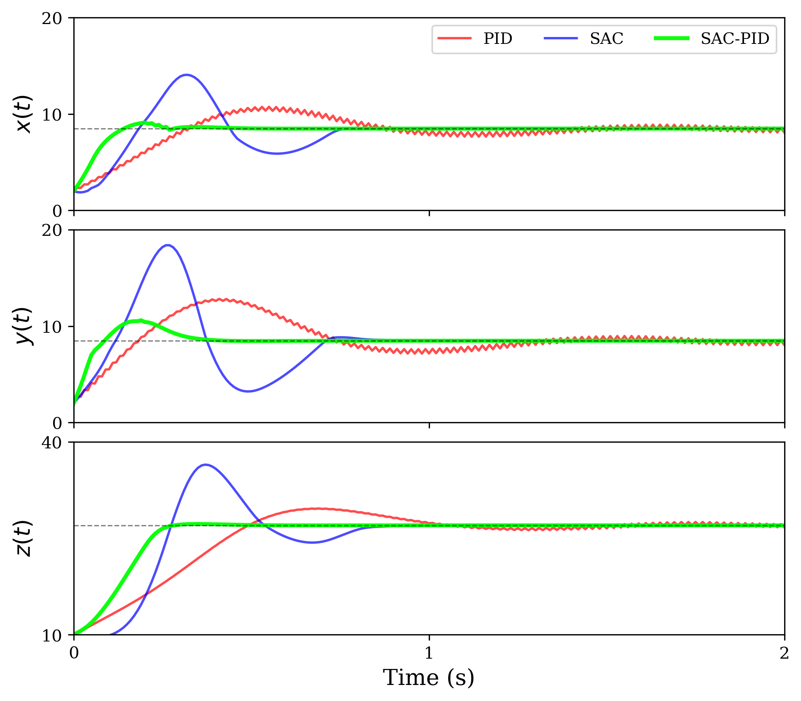
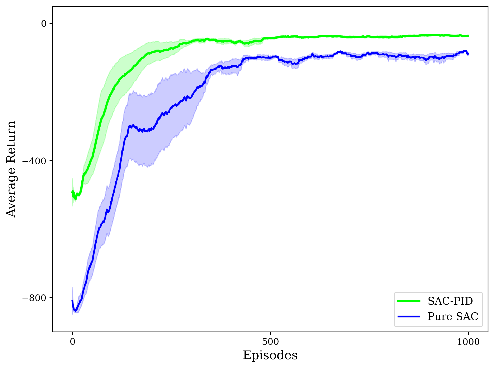
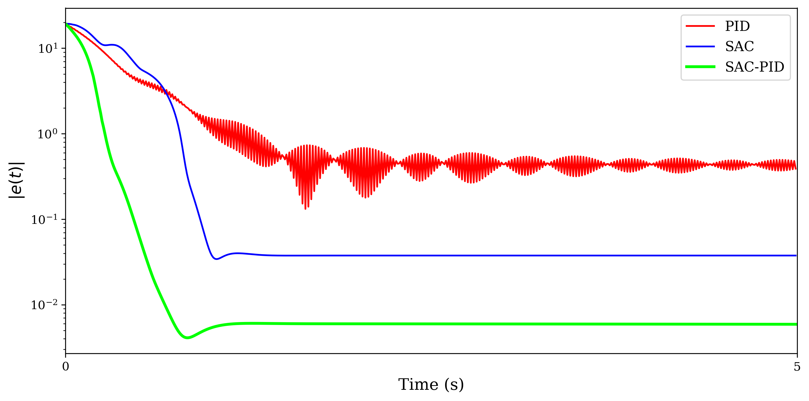
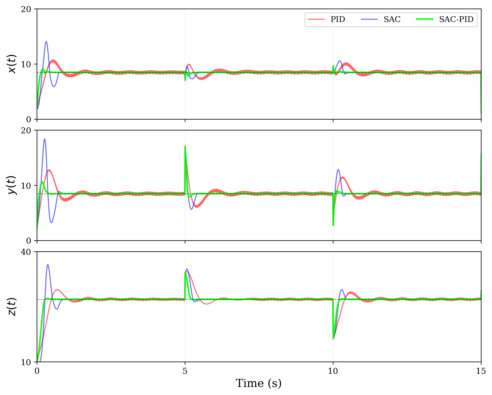

# SAC-PID Chaos Control

该仓库实现并评估 SAC-PID 混合控制器在 Lorenz 与 Lorenz96 混沌系统上的镇定和抗扰控制性能。控制器以 PID 为结构化执行基座，由 Soft Actor-Critic (SAC) 在线整定 PID 增益，从而兼顾可解释性与自适应能力。

## 环境

本项目在 Python 3.9.25 的 Anaconda `DL` 环境中验证。安装依赖：

```bash
pip install -r requirements.txt
```

## 目录结构

- `lorenz/`：三维 Lorenz 系统实验。
- `lorenz96/`：40 维 Lorenz96 时空混沌系统实验。
- 各实验目录中的 `main/`、`bayesian_optimization/`、`optimization_results/`、`figures/`、`tables/` 分别存放主程序、Optuna 调参代码、最优参数 JSON、图像和结果表。
- `checkpoints/`：训练模型权重及对应回报数组。

## Lorenz 系统实验结果

实验比较固定参数 PID、端到端 SAC 与 SAC-PID 三种控制器。SAC-PID 通过在线调整 PID 的三个增益，使其在无扰动镇定与周期扰动下兼具更快收敛、更高稳态精度和更短恢复时间。

### 无扰动状态轨迹

SAC-PID 在三个状态通道上以较小超调快速回到目标不动点邻域；固定参数 PID 收敛较慢，端到端 SAC 在瞬态阶段存在更明显的超调和回摆。



### 训练回报

两种基于 SAC 的控制器均能收敛；SAC-PID 的回报上升更快，最终稳定回报也更高，说明在 PID 参数空间内探索具有更高效率。



### 误差范数

对数坐标下，SAC-PID 最先将误差范数降至阈值以下并稳定保持，体现出更快的收敛速度和更高的稳态精度。



### 周期扰动响应

在周期性外部扰动后，SAC-PID 以较小振荡幅度和较短时间恢复至目标邻域，抗扰恢复能力优于两个基线控制器。



### 表 3-3：Lorenz 系统性能指标综合对比

论文中的完整数值表已上传为 [table_3_3.csv](lorenz/tables/table_3_3.csv)。数值覆盖无扰动镇定与周期扰动两类场景：稳态误差、RMSE 和收敛时间反映镇定性能，平均恢复时间反映抗扰能力。

| 指标 | 固定参数 PID | 端到端 SAC | SAC-PID 混合 |
| --- | ---: | ---: | ---: |
| 稳态误差 $\|e\|$ | 0.4337 | 0.0376 | **0.0056** |
| RMSE | 1.8969 | 2.1970 | **1.3019** |
| 收敛时间 / s | 1.330 | 0.790 | **0.270** |
| 平均恢复时间 / s | 1.022 | 0.485 | **0.200** |

SAC-PID 的稳态误差相较固定参数 PID 低约两个数量级、相较端到端 SAC 低约一个数量级；其收敛时间分别缩短约 80% 和 66.7%，平均恢复时间分别缩短约 80% 和 60%。端到端 SAC 的 RMSE 高于固定参数 PID，主要与初始瞬态阶段的较大超调有关。

## 运行

从仓库根目录运行，例如：

```bash
python -m lorenz.main.lorenz_8
python -m lorenz96.main.lorenz96_main
```